<p align="center">
  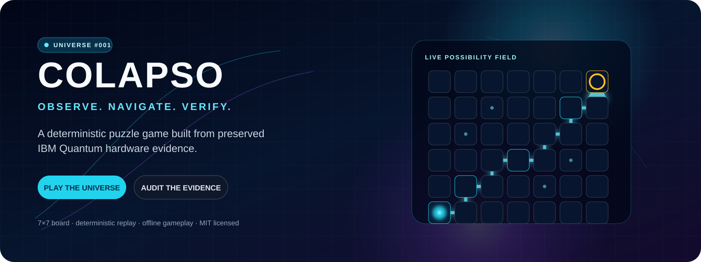
</p>

<p align="center">
  <strong>A deterministic puzzle game whose playable universe is compiled from preserved IBM Quantum hardware evidence.</strong><br />
  Observe uncertain cells, manage a finite resource budget, survive decoherence, and reach the golden exit.
</p>

<p align="center">
  <a href="https://production.d333fud52cy2ho.amplifyapp.com"></a>
  <a href="https://github.com/jpablortiz96/colapso-quantum-game/actions/workflows/ci.yml"></a>
  <a href="LICENSE"></a>
  
</p>

<p align="center">
  <a href="#play-now">Play now</a> ·
  <a href="#how-it-plays">Gameplay</a> ·
  <a href="#quantum-provenance">Quantum provenance</a> ·
  <a href="#architecture">Architecture</a> ·
  <a href="#run-locally">Run locally</a> ·
  <a href="#scientific-boundaries">Scientific boundaries</a>
</p>

> **Language note:** the player experience is intentionally Spanish (`es-419`). Source code and public engineering documentation are English.

## Play now

**[Launch the production game →](https://production.d333fud52cy2ho.amplifyapp.com)**

No account, wallet, API key, quantum-provider access, or installation is required. The deployed application is a static SPA: once its assets and published universe are loaded, gameplay runs locally in the browser.

<p align="center">
  <a href="https://production.d333fud52cy2ho.amplifyapp.com">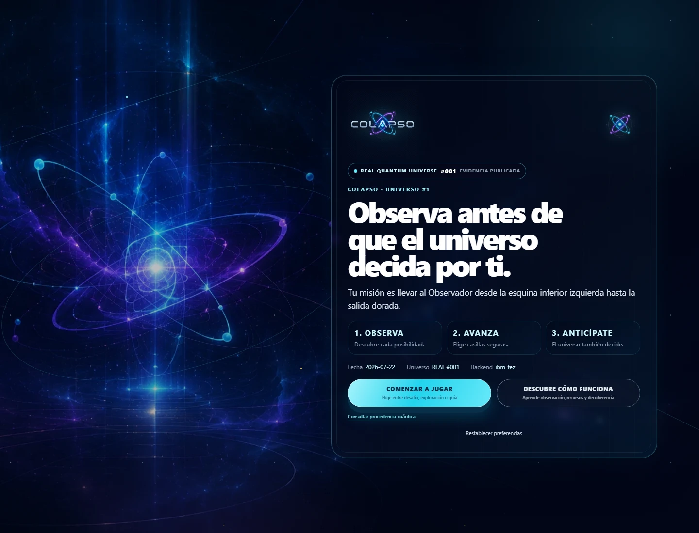</a>
</p>

## Why COLAPSO is different

Many “quantum” games use the word as a visual theme. COLAPSO makes provenance part of the system:

- **A real evidence pack:** preserved SamplerV2 and EstimatorV2 exports from IBM Quantum hardware, with a manifest and SHA-256 checksums.
- **A compiled universe:** accepted material is expanded through a documented SHA-256 counter-mode construction into a versioned 7×7 board and deterministic resolution plan.
- **A pure rules engine:** observation, movement, entanglement policies, decoherence, scoring, serialization, and replay are deterministic F1 rules.
- **An inspectable client:** the board, resolution plan, evidence references, and integrity commitment are public. COLAPSO does not claim anti-cheat secrecy.
- **Bounded scientific language:** the repository separates measurements from interpretations and states what the evidence does *not* establish.

The game does **not** submit a quantum job for each move. Quantum acquisition happened before publication; the browser consumes preserved, versioned artifacts.

## How it plays

Your observer starts in the lower-left corner. The exit is in the upper-right. Most cells begin as possibilities:

1. **Observe** a possibility to resolve it, spending one observation.
2. **Navigate** through traversable outcomes while managing energy and resources.
3. **Anticipate decoherence:** every fourth turn, the field resolves another possibility on its own.
4. **Reach the exit** with a replayable action transcript.

Three modes use the same published universe and core rules:

| Mode | Purpose | Presentation |
| --- | --- | --- |
| **Quantum Mission** | Canonical challenge | 10 observations, official score, no hints or rewind |
| **Explorer** | Learn through assisted planning | 13 observations, visible tactical margin, five optional pulses |
| **Guided Journey** | Follow one audited solution | 23 explicit steps, three rewinds, non-competitive result |

See [Gameplay](docs/GAMEPLAY.md) for controls, resources, powers, accessibility, and mode details.

### Single-screen desktop cockpit

During active play at supported desktop cockpit sizes (at least 1100×680), the complete 7×7 board, command telemetry, decoherence pressure, resource state, quantum powers, and primary Observer Console action share one browser viewport. Document scrolling is disabled only for that active desktop state; dialogs retain their own safe overflow. Tablet and mobile layouts keep a natural single document flow without a nested console scrollbar, while optional probabilities, coherence, event history, tactical details, help, and provenance remain available under **Más telemetría**.

The cockpit changes presentation only. Observation budgets, powers, score, decoherence cadence, hidden results, replay, keyboard semantics, and the published universe are unchanged.

<table>
  <tr>
    <td width="50%">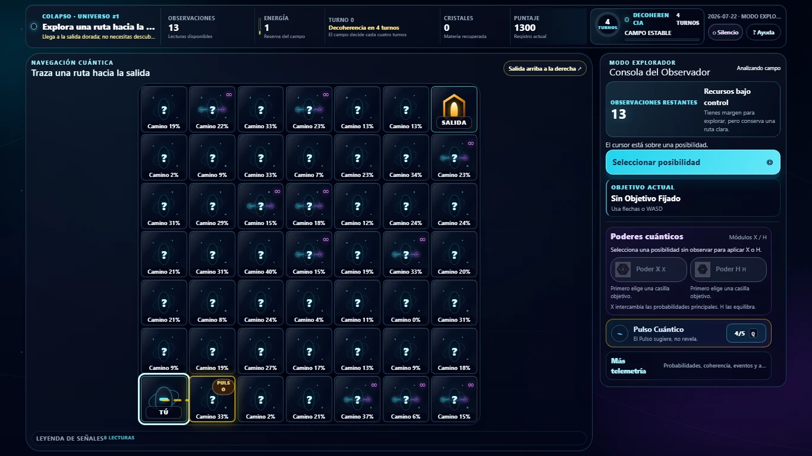</td>
    <td width="50%">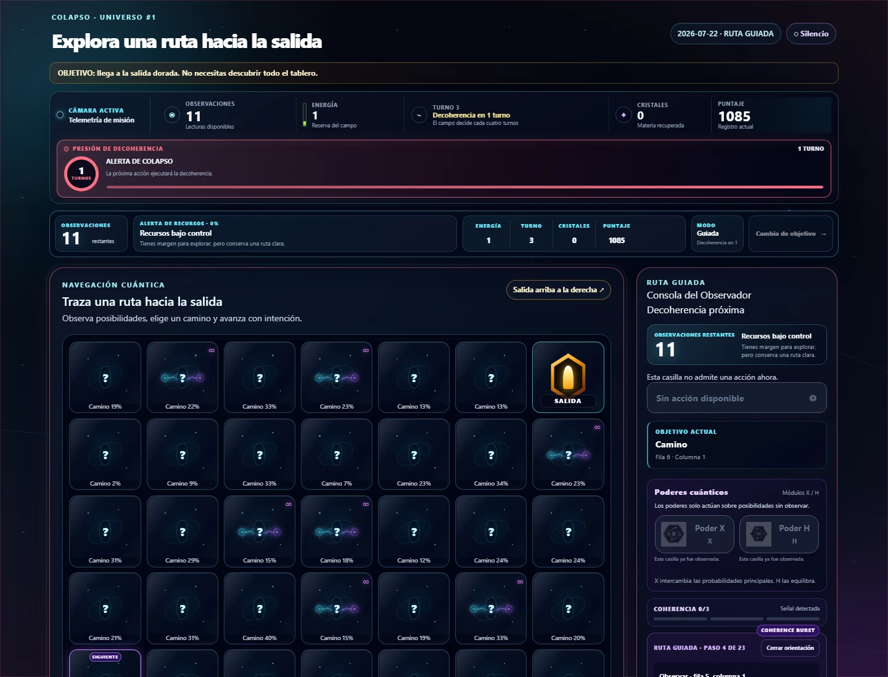</td>
  </tr>
  <tr>
    <td align="center"><strong>Explorer mode</strong><br />Visible planning support without changing F1 rules.</td>
    <td align="center"><strong>Decoherence pressure</strong><br />A persistent warning before the next collapse.</td>
  </tr>
  <tr>
    <td>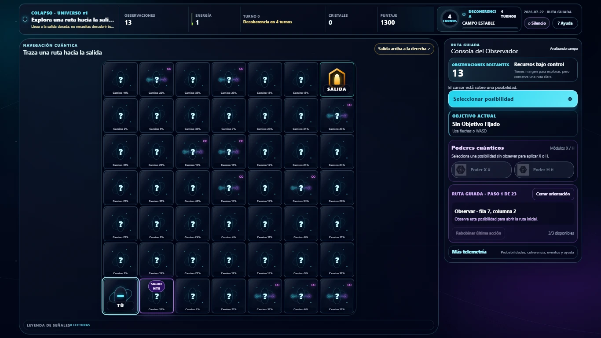</td>
    <td>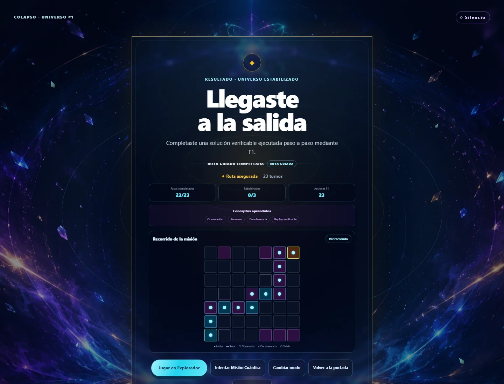</td>
  </tr>
  <tr>
    <td align="center"><strong>Guided Journey</strong><br />Concepts introduced through real player actions.</td>
    <td align="center"><strong>Verifiable result</strong><br />Route, metrics, and transcript-derived outcome.</td>
  </tr>
</table>

<p align="center">
  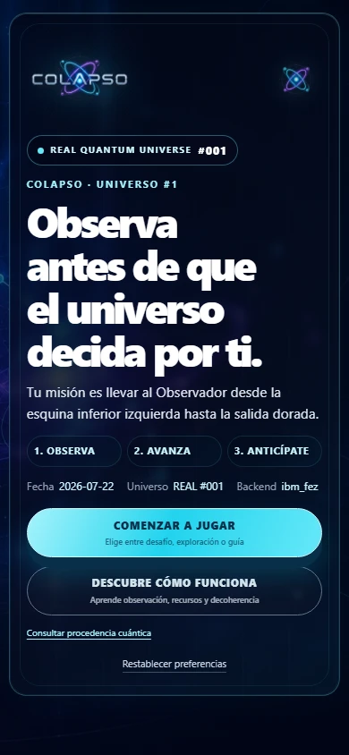
</p>
<p align="center"><strong>Responsive by design.</strong> The same production experience adapts to a narrow touch viewport without a separate client.</p>

## Quantum provenance

<p align="center">
  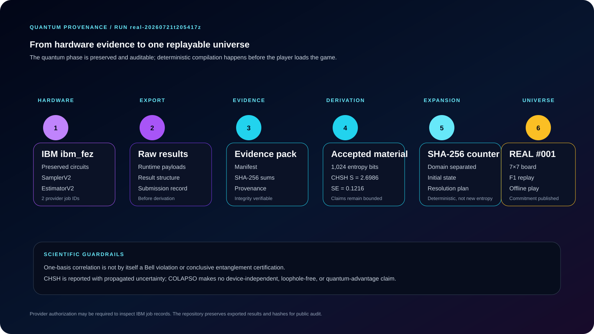
</p>

The published universe is `colapso-2026-07-22-001`. Its source evidence is preserved under [`evidence/runs/real/real-20260721t205417z`](evidence/runs/real/real-20260721t205417z/).

| Fact | Published value |
| --- | --- |
| Hardware backend | `ibm_fez` |
| Runtime primitives | SamplerV2 and EstimatorV2 |
| Accepted entropy material | 1,024 bits |
| One-basis observed correlation | `0.9140625` from 256 shots |
| CHSH witness | `2.698628939348193` |
| Propagated standard error | `0.12161062756743832` |
| Classical CHSH bound | `2` |
| Evidence classification | `STATISTICALLY_SUPPORTED_ABOVE_CLASSICAL_LIMIT` |
| Expansion | SHA-256 counter mode, domain separated |
| Universe commitment | `bcff83aade29774587a84df10a9e168f5828e705728981d4eb8caf4075875579` |

The in-game provenance panel exposes the same chain and its limitations:

<p align="center">
  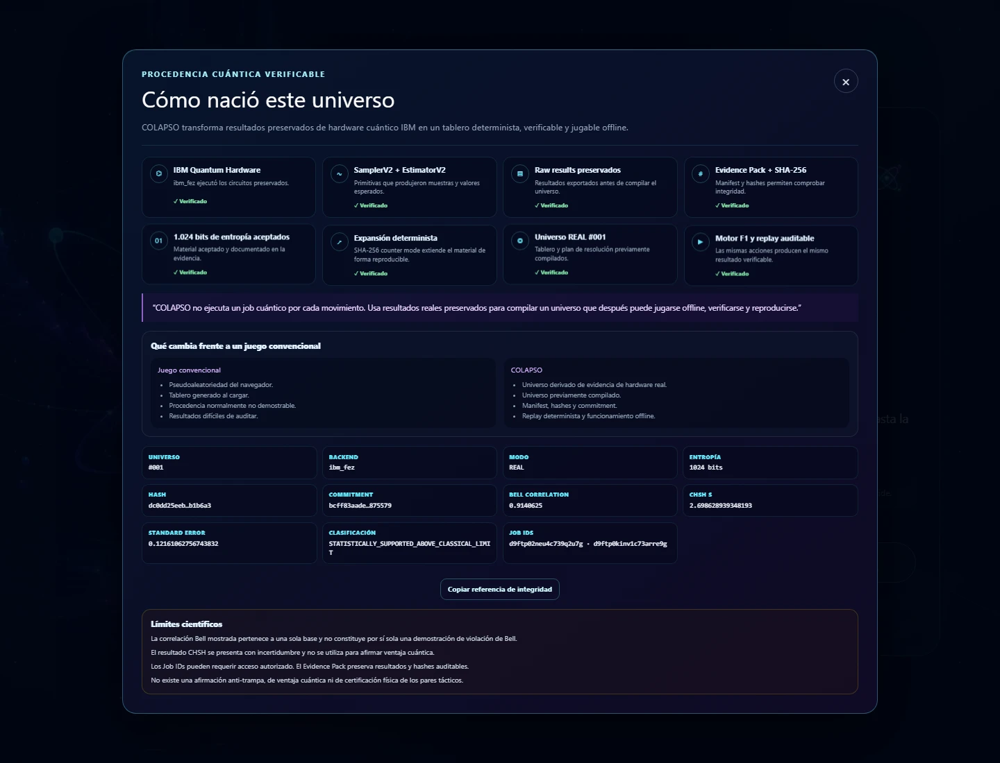
</p>

Read [Quantum Provenance](docs/QUANTUM_PROVENANCE.md) for artifact-level details and [Evidence](docs/EVIDENCE.md) for the evidence contract.

## Scientific boundaries

COLAPSO reports preserved measurements; it does not inflate them into broader claims.

- The displayed Bell correlation is a **single-basis correlation**. By itself it is not a Bell violation or conclusive entanglement certification.
- The CHSH witness is reported with propagated uncertainty. It is not presented as device-independent or loophole-free.
- No quantum-advantage claim is made.
- Tactical “entangled pairs” are deterministic game mechanics; they are not claims about persistent physical qubit pairs.
- SHA-256 expansion makes accepted source material reproducible; it does not create or certify new physical entropy.
- Provider job records can require authorized IBM access. Public exports, provenance, and hashes remain independently inspectable here.
- The client publishes its resolution material. No anti-cheat or unpredictability guarantee is claimed.

See [Claims](docs/CLAIMS.md) for the complete claim ledger.

## Architecture

<p align="center">
  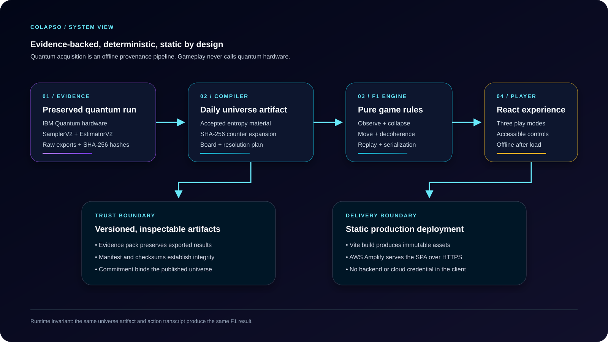
</p>

COLAPSO separates acquisition, compilation, deterministic rules, and presentation:

```text
preserved IBM evidence
        ↓
daily-universe compiler → versioned universe JSON + commitment
        ↓
pure TypeScript F1 engine → deterministic state transitions + replay
        ↓
React presentation → three modes, accessibility, sound, responsive UI
        ↓
Vite static build → AWS Amplify Hosting
```

The production runtime has no application backend and no quantum-provider credential. Python tooling under `backend/` creates and verifies evidence offline; the browser never imports it. See [Architecture](docs/ARCHITECTURE.md) for trust boundaries and module ownership.

## Run locally

### Prerequisites

- Node.js 22 or newer
- npm 10 or newer (the lockfile records npm 11.8.0)
- Git

### Frontend

```bash
git clone https://github.com/jpablortiz96/colapso-quantum-game.git
cd colapso-quantum-game
npm ci
npm run dev --workspace frontend
```

Vite prints the local URL. No IBM or AWS credential is needed to build, test, or play.

### Verification

```bash
npm run lint
npm run test -- --run
npm run build
npm run verify:production
npm run verify:amplify-package
npm run verify:public-repo
npm run scan:secrets
```

CI runs repository, frontend, evidence, media, privacy, production, and packaging gates on every pull request and on pushes to `main`. Verification commands fail closed; no CI job receives AWS or IBM credentials.

### Optional Python evidence tooling

The Python tooling requires Python 3.12 and pinned dependencies from `backend/uv.lock`:

```bash
cd backend
uv sync --frozen
uv run pytest
uv run python -m colapso_quantum.cli simulate --seed 7 --shots 256
```

Simulation output is always labeled simulated. Live submission is optional, credentialed, and outside normal development; read [`backend/README.md`](backend/README.md) before using it.

## Repository map

| Path | Responsibility |
| --- | --- |
| `frontend/src/engine/` | Pure deterministic game rules and replay contracts |
| `frontend/src/daily-universe/` | Evidence-to-universe compilation and verification |
| `frontend/src/components/` | Spanish player experience and accessible controls |
| `frontend/public/data/universes/` | Published universe index and immutable artifact |
| `backend/src/colapso_quantum/` | Qiskit evidence, provider, and provenance tooling |
| `evidence/runs/real/` | Preserved real-hardware evidence packs |
| `evidence/runs/simulated/` | Explicitly labeled local simulation evidence |
| `deployment/aws-amplify/` | Reproducible static packaging, deployment, and verification |
| `docs/` | Architecture, claims, gameplay, provenance, and operations |
| `scripts/` | Repository verifiers, screenshot capture, and release tooling |

## Built with Kiro

<p align="center">
  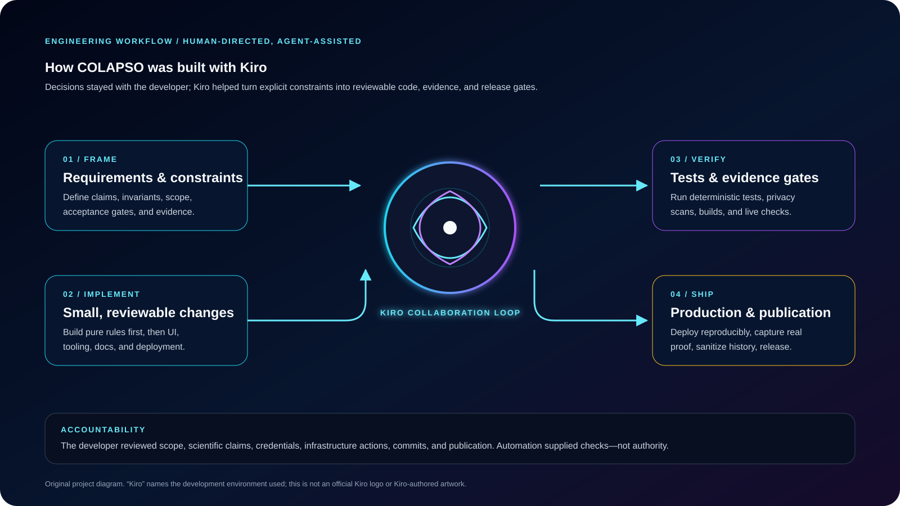
</p>

Kiro was used as an agentic development environment for requirements refinement, implementation, test feedback, evidence review, deployment automation, and public-release curation. The developer retained responsibility for scope, claims, credentials, infrastructure actions, commits, and publication. Read [Built with Kiro](docs/BUILT_WITH_KIRO.md) for the workflow and artifact policy.

The diagram above is original project artwork. It does not use or represent an official Kiro logo.

## Production and security

- **Live application:** [production.d333fud52cy2ho.amplifyapp.com](https://production.d333fud52cy2ho.amplifyapp.com)
- **Hosting:** manually deployed static AWS Amplify branch with SPA routing and explicit security/cache headers
- **Readiness:** [Production Readiness](docs/PRODUCTION_READINESS.md)
- **Deployment:** [AWS Amplify guide](deployment/aws-amplify/README.md)
- **Vulnerabilities:** use [GitHub private vulnerability reporting](SECURITY.md); do not open a public issue for sensitive reports

## Contributing

Issues and focused pull requests are welcome. Start with [CONTRIBUTING.md](CONTRIBUTING.md), preserve deterministic behavior, label simulated evidence, and keep scientific claims within the published guardrails.

## License

Released under the [MIT License](LICENSE). Copyright © 2026 COLAPSO contributors.
